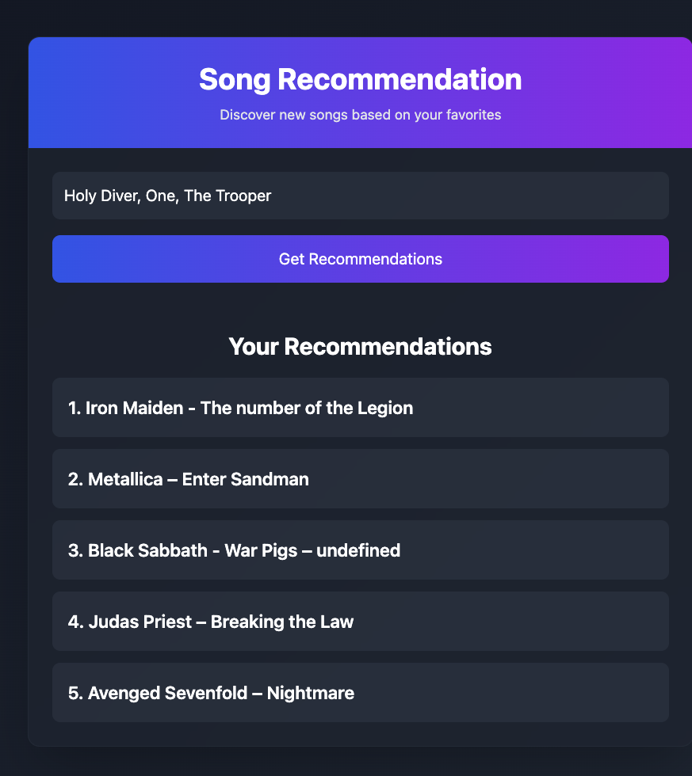

# 🎵 Song Recommendation App

A web application that provides personalized song recommendations using **Ollama** and **Llama3.2** (local LLM), built with Tailwind CSS and JavaScript.



## 🚀 Quick Start

1. **Clone the repository**

```bash
git clone https://github.com/your-username/song-recommendation-app.git
cd song-recommendation-app
```

2. **Install dependencies**

```bash
npm install
```

3. **Set up Ollama and Llama3.2**

   - Install [Ollama](https://ollama.ai/) on your local machine.
   - Pull the Llama3.2 model:

```bash
ollama pull llama3.2
```

4. **Start the backend server**

   The backend server connects to Ollama's local API.

```bash
node server/server.js
```

5. **Start the frontend client**

   In a new terminal, start the Vite development server:

```bash
npm run dev
```

6. **Access the application**

   The application will be available at `http://localhost:5173`.

---

## 🛠️ Tech Stack

- **Frontend**: HTML5, Tailwind CSS, JavaScript
- **Backend**: Node.js, Express.js
- **LLM**: Llama3.2 (via Ollama)
- **Build Tools**: Vite, npm

---

## 📁 Project Structure

```
song-recommendation-app/
├── dist/               # Compiled assets
├── server/
│   └── server.js       # Backend server (Ollama API integration)
├── src/
│   ├── input.css       # Tailwind input
│   └── main.js         # Core logic
├── index.html          # Entry point
├── package.json        # npm dependencies
└── README.md           # Project documentation
```

---

## 💡 How It Works

1. **User Input**:

   - Enter your favorite songs in the input field (e.g., `"Let Down" by Radiohead, "Sunsetz" by Cigarettes After Sex`).

2. **AI Analysis**:

   - The app sends your input to the local Ollama server running the Llama3.2 model.

3. **Recommendations**:

   - The LLM analyzes the input and generates 5 personalized song recommendations.

4. **Output**:
   - The recommendations are displayed in a clean, numbered list.

---

## 🔧 Configuration

### Backend (Ollama Integration)

- The backend server connects to Ollama's local API at `http://localhost:11434/v1`.
- Ensure Ollama is running and the Llama3.2 model is loaded.

### Frontend

- The frontend communicates with the backend server at `http://localhost:3001`.
- No API keys are required since the LLM runs locally.

---

## 🌟 Features

- **Local LLM Integration**: Uses Ollama and Llama3.2 for privacy and offline capabilities.
- **Tailwind CSS**: Modern and responsive UI design.
- **Customizable Prompts**: Easily modify the system and user prompts for different use cases.

---

## 🐛 Troubleshooting

### Ollama Not Responding

- Ensure Ollama is installed and running.
- Verify that the Llama3.2 model is loaded:

```bash
ollama list
```

### Backend Server Issues

- Check if the backend server is running on port `3001`.
- Ensure the frontend is correctly configured to communicate with the backend.

### No Recommendations

- Check the console for errors.
- Ensure the input format is correct (e.g., `"Song 1" by Artist 1, "Song 2" by Artist 2`).

---

## 🙏 Acknowledgments

- [Ollama](https://ollama.ai/) for providing an easy-to-use local LLM solution.
- [Llama3.2](https://ollama.ai/library/llama3.2) for powering the recommendation engine.
- [Tailwind CSS](https://tailwindcss.com/) for the beautiful and responsive UI.

---
